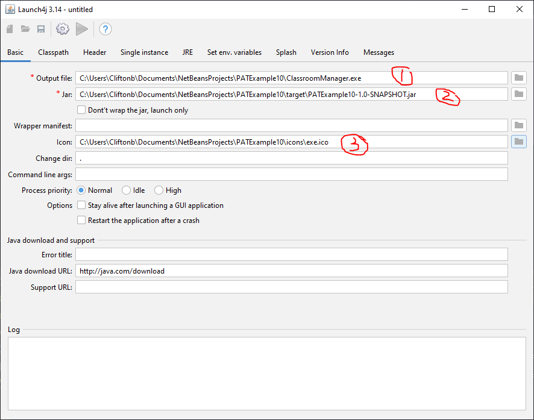
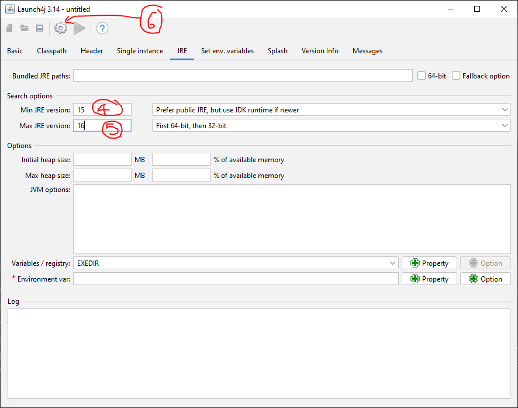
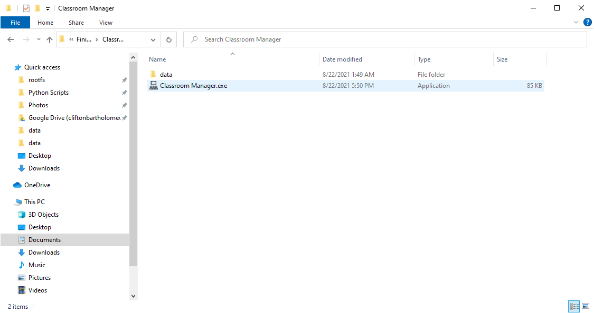

# PATExample

## Folder Structure
#### data
This folder contains all the text files or databases that will be used to store the data of the running program.

#### src/main/resources/images
This folder contains all the images that are used in the UI. It MUST be in this location. I found that 64x64 images are a good size for use as icons. You cannot resize the images within the code, so make sure to resize the images within an image editor to the appropriate size before using it in your program.

Visit: https://www.flaticon.com/ for free icons
* 64 x 64 are a good size for icons in a UI
* 16 x 16 are a good size for .exe icons (you can convert a .png to a .ico at https://cloudconvert.com/png-to-ico

#### src/main/java/
This folder contains all the source code. It is split into two packages: backend and UI. 
* backend - this code is responsible for the manipulation of the data in the permanent storage and all program logic.
* UI - this code is responsible for getting data from the user and "passing" it to the backend for manipulation then updating the UI to show the results to the user. The UI NEVER does any program logic or data manipulation.

## Comments
**Read all the comments** in the code. I have tried as clearly as possible to spell out what each section of the code does.

The **AssessmentManager** in the backend contains most of the backend comments as the other backend classes are fairly similar.

## Tools
Project is created with:
* Java: 15.0.1 or above (comes with the JDK)
* Netbeans 12.2 or above
* Java compiler: 15.0.1 or above (comes with the JDK)
* Launch4j: 2.1.1

## Creating an exe
* Make sure you have all the tools above installed.
* Download the source code and add it to Netbeans as a Netbeans project (I recommend cloning it with GitHub).
* Right click on the project in NetBeans and select 'Clean and Build'. This creates a .jar of the project in the PATExample/target directory.
* The above .jar file contains all the src code only.
* The launch4j packages the .jar into a single an .exe file. Note the settings below. There are FIVE inputs you need to add to the program before clicking the gear button.

* Note this exe only contains the source code. You must have the **data** and **icons** folders in the same folder as the .exe for your program to work.

